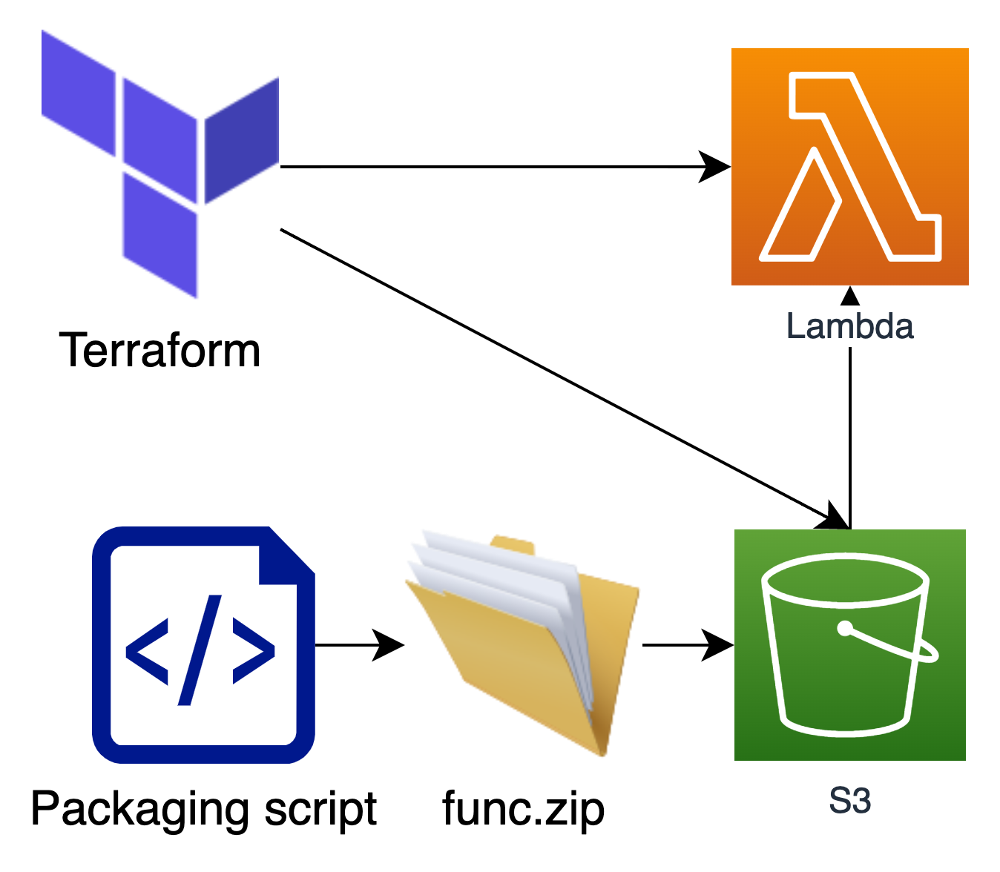
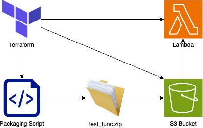
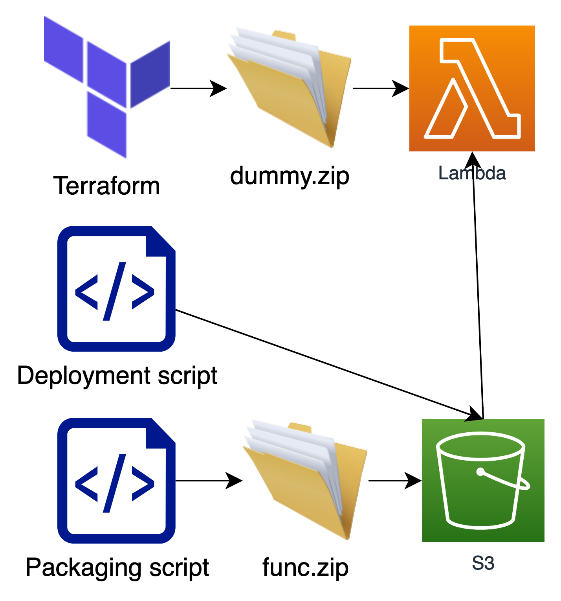

## Option 1
Manage both the function and its provisioning in Terraform using a local file deployment package

## Option 2
Entirely decoupled by having a script that manages the packaging of the Lambda

## Option 3
Similar to option 2 though through use of s3_object and locals, terraform checks for the presence of the function code bundle with the appropriate name/tag/meta and invokes the packaging script if it doesn't exist.

## Option 4
Similar to Option 2 and 3. Have terraform check for the presence of the code package in S3, if it doesn't exist, terraform will bundle the package, upload it and use that reference.

## Option 5
Similar to option 2, however the lambda terraform deployed is done with a dummy function, a deployment script is added to push the bundled code from S3 to the function when ready
