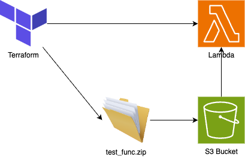

# Lambda Build Mechanism PoCs
| Option | Build time | Statefile size |
| --- | --- | --- |
| Option 1 | 16s | 8K |
| Option 2 | 20s | 8K |
| Option 3 | N/A | N/A |
| Option 4 | 18s | 12K |
| Option 4.5 | 18s | 12K |
| Option 5 | 21s | 8K |

## Option 1
Manage both the function and its provisioning in Terraform using a local file deployment package

## Option 2
Entirely decoupled by having a script that manages the packaging of the Lambda

## Option 3
Similar to option 2 though through use of s3_object and locals, terraform checks for the presence of the function code bundle with the appropriate name/tag/meta and invokes the packaging script if it doesn't exist.

## Option 4
Similar to Option 1 & 2. Have Terraform manage the archive, but store it in S3 for retreval, rolling the code in to lambda only if the commit reference for the build has changed.

### Option 4.5
The same as option 4, but includes support for a additional directories which need including, things like a 'common' library/module etc.

## Option 5
Similar to option 2, however the lambda terraform deployed is done with a dummy function, a deployment script is added to push the bundled code from S3 to the function when ready

