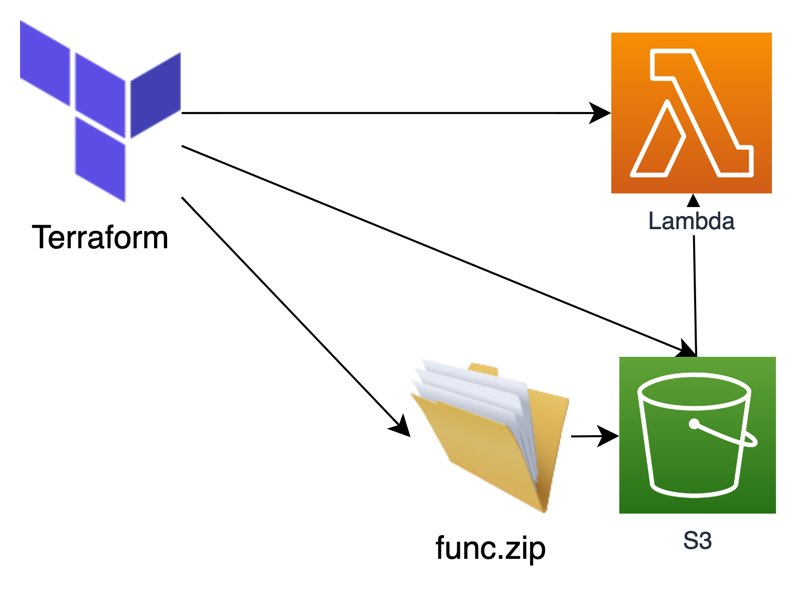

# Option 4
Similar to Option 2 and 3. Have Terraform check for the presence of the code package in S3, if it doesn't exist, terraform will bundle the package, upload it and use that reference.

The resulting solution is also similar to option 1 in that Terraform handles the build of the package, and is also uploading a potentially larger amount of data than is ideal. Though it does meet more requirements.

## Requirements
| Requirement | Met |
| ------------|-----|
| Lambda function code should be versioned, promotable, and targetable  | :heavy_check_mark: |
| An environment should be able to use a specific code version | :heavy_check_mark: |
| The code a function is running should be identifiable and retrievable for analysis | :heavy_check_mark: |
| Code must be testable and tested | :heavy_check_mark: |
| Functions should not be replaced unless change has occured | :heavy_check_mark: |

### Cons
 - Potential for over-engineering or being overly complicated

### Pros
 - Creative use of tagging objects and conditionals to resolve the identification of package tags
 - Automates some of the manual steps in separation of the workflow
 - Medium complexity
 - Meets all of the requirements
 - Can include commit refs on the object to aid with identification

### Notes
