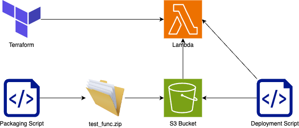

# Option 5
Similar to option 2, however the lambda terraform deployed is done with a dummy function, a deployment script is added to push the bundled code from S3 to the function when ready

## Requirements
| Requirement | Met |
| ------------|-----|
| Lambda function code should be versioned, promotable, and targetable  | :heavy_check_mark: |
| An environment should be able to use a specific code version | :heavy_check_mark: |
| The code a function is running should be identifiable and retrievable for analysis | :heavy_check_mark: |
| Code must be testable and tested | :heavy_check_mark: |
| Functions should not be replaced unless change has occured | :heavy_check_mark: |

### Cons
 - Potential for over-engineering
 - Risk that dummy code is left deployed

### Pros
 - Automates some of the manual steps in seperation of the workflow
 - Medium complexity
 - Meets all of the requirements

### Notes
